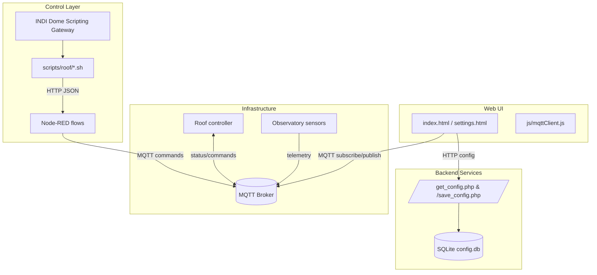

# pi-roof

Web interface for monitoring and controlling a small observatory and related hardware.

## System overview



## Features

- **Observatory control panel** (`index.html`): displays sensor values such as clouds, rain, light, dew point, SQM and star count via MQTT and provides toggle buttons for devices.

- **Settings editor** (`settings.html`): allows updating MQTT connection details stored in the local SQLite database.

The site depends on MQTT for live updates. The helper in `js/mqttClient.js` treats broker `offline` events the same as a `close`, prompting the UI to show "Reconnecting..." when the connection silently drops.

## MQTT Configuration
Connection details are stored in a SQLite `config.db` database located at `/var/www/data/config.db` outside the web root. Client-side scripts load these settings through `js/mqttConfig.js` which fetches `/get_config.php`.

Use `settings.html` to edit values such as broker URL, port, username, password and dashboard topics. Changes are saved via `/save_config.php` and take effect immediately on subsequent page loads.

### First-time database setup
The application will create tables automatically the first time `/get_config.php` or `/save_config.php` is accessed, but you still need to create the directory and database file with permissions that your web server user can write to. A typical setup looks like:

```bash
sudo mkdir -p /var/www/data
sudo touch /var/www/data/config.db
sudo chown www-data:www-data /var/www/data/config.db
sudo chmod 664 /var/www/data/config.db
```

After that, open `settings.html` or load `/get_config.php` once to initialize the schema.

## RoRo roof controller (INDI Dome Scripting Gateway)

This repository now includes a roll-off roof controller that follows the INDI Dome Scripting Gateway pattern. Shell scripts in `scripts/roof/` call a Node-RED HTTP endpoint, which translates requests into MQTT commands and waits for state changes.

### Quick start

1. Import the Node-RED flow from `nodered/flows/roof-api.json` and point the MQTT broker config node at your existing broker. See `docs/nodered-deploy.md` for details.
2. Ensure the scripts are executable:
   ```bash
   chmod +x scripts/roof/*.sh
   ```
3. Point INDI Dome Scripting Gateway at the scripts in `scripts/roof/` (see `docs/indi-dome-scripting-gateway.md`).

### Environment variables

Shell scripts:
- `ROOF_BASE_URL` (default: `http://data.smeird.com:1880`)
- `ROOF_HTTP_PATH` (default: `/api/roof`)
- `CURL_TIMEOUT_SECS` (per-script default: status/connect/disconnect 20s, abort 90s, open/close/park/unpark 900s)

Node-RED flow:
- `OPEN_TIMEOUT_SECS=900`
- `CLOSE_TIMEOUT_SECS=900`
- `ABORT_TIMEOUT_SECS=90`
- `CONNECT_TIMEOUT_SECS=5`

### Curl examples

```bash
curl -fsS -H "Content-Type: application/json" -d '{"action":"status"}' http://data.smeird.com:1880/api/roof
curl -fsS -H "Content-Type: application/json" -d '{"action":"open"}' http://data.smeird.com:1880/api/roof
curl -fsS -H "Content-Type: application/json" -d '{"action":"close"}' http://data.smeird.com:1880/api/roof
```
