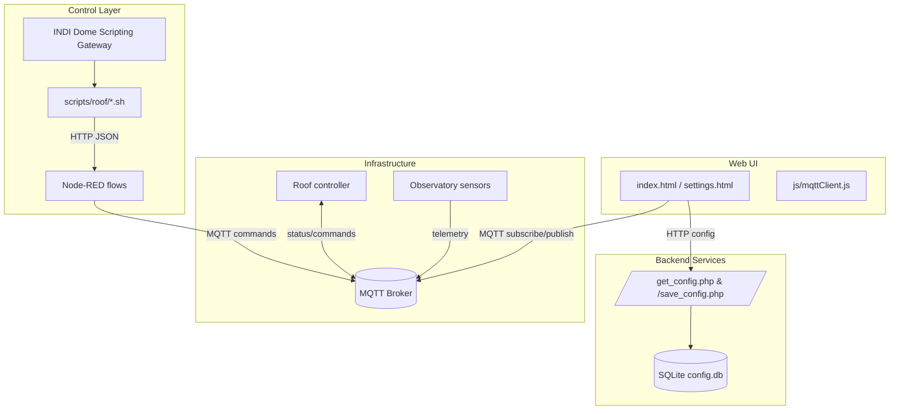

# pi-roof

Web interface for monitoring and controlling a small observatory and related hardware.

## System overview


```mermaid
flowchart TD
    subgraph WebUI[Web UI]
        UI[index.html / settings.html]
        MQTTClient[js/mqttClient.js]
    end
    subgraph Backend[Backend Services]
        PHP[/get_config.php & /save_config.php/]
        DB[(SQLite config.db)]
    end
    subgraph Control[Control Layer]
        NR[Node-RED flows]
        Scripts[scripts/roof/*.sh]
        INDI[INDI Dome Scripting Gateway]
    end
    subgraph Infra[Infrastructure]
        MQTT[(MQTT Broker)]
        Roof[Roof controller]
        Sensors[Observatory sensors]
    end

    UI -->|HTTP config| PHP
    PHP --> DB
    UI -->|MQTT subscribe/publish| MQTT
    Sensors -->|telemetry| MQTT
    Roof <-->|status/commands| MQTT
    Scripts -->|HTTP JSON| NR
    INDI --> Scripts
    NR -->|MQTT commands| MQTT
```

## Features

- **Observatory control panel** (`index.html`): a single-screen operations dashboard for sensors, roof safety and commands, device toggles, live trends, and SkyCam monitoring.

- **Settings editor** (`settings.html`): configures MQTT and InfluxDB connections, sensors, the roof controller base topic and relays, auxiliary devices, dashboard panels, and quick links.

- **Shared themes** (`js/theme.js`): consistent Light, Dark, and System modes across the dashboard, settings, and history pages.

The SkyCam panel also shows the live realtime keogram from the SkyCam viewer and refreshes it approximately once per minute.

The site depends on MQTT for live updates. The helper in `js/mqttClient.js` treats broker `offline` events the same as a `close`, prompting the UI to show "Reconnecting..." when the connection silently drops.

## MQTT Configuration
Connection details are stored in a SQLite `config.db` database located at `/var/www/data/config.db` outside the web root. Client-side scripts load these settings through `js/mqttConfig.js` which fetches `/get_config.php`.

Use `settings.html` to edit the broker, history connection, dashboard panels, sensors, controller relays, auxiliary devices, and quick links. Changes are saved via `/save_config.php` and take effect on subsequent page loads.

The roof controller follows the standard `roof-esp` topic contract. Configure its base topic once in Settings; command, telemetry, and relay topics are derived from it. Existing installations are migrated non-destructively when the configuration endpoints are first loaded.

## Deployment

### Observatory camera (Tapo TC70)

The TC70 at `10.0.179.35` uses its local **Camera Account** (Tapo app → camera settings → Advanced Settings → Camera Account). The bridge uses the verified high-quality `/stream1` RTSP feed. Browsers receive a rolling HLS video buffer through `/camera.php`; camera credentials are never returned to the browser or saved in Git. The feed is accessible to the same audience as the roof dashboard. There is no permanent recording, and playback is several seconds behind the camera.

On `data`, install the user service and enter the account interactively:

```bash
mkdir -p ~/.config/systemd/user
cp /var/www/roof/scripts/camera/roof-camera.service ~/.config/systemd/user/
systemctl --user daemon-reload
systemctl --user enable roof-camera.service
python3 /var/www/roof/scripts/camera/configure.py
loginctl enable-linger dom
```

The last command keeps the service running after logout and at boot; an administrator may need to run it. Requires Python 3 and FFmpeg. The small rolling buffer is in `/var/tmp/roof-camera`; stale video is refused after 20 seconds. The dashboard retries an unavailable feed automatically. Settings → Dashboard can hide the observatory camera. Use `systemctl --user status roof-camera` to check service status without exposing credentials.

The live checkout is `/var/www/roof` on `data`. To allow the `dom` deployment account to update the application without a repeated root prompt, run this one-time command on `data` as an administrator:

```bash
sudo chown -R dom:dom /var/www/roof
```

Then, from a login shell on the development Mac, reload the profile and deploy with:

```bash
source ~/.profile
deploy-roof
```

The helper performs a fast-forward-only pull from `origin/main` and runs PHP syntax checks. The SQLite database remains outside the checkout at `/var/www/data/config.db`.

### Night forecast

The Night planner uses the Metcheck astronomy forecast for the Weather site's
observatory location. Settings → Night forecast controls green/amber cloud limits
and the optional seeing-index check. This planning guide does not change live
sensor status or roof controls. The sunset-to-sunrise timeline uses UK local time
and retains the current night after midnight until sunrise. Tap or focus a
segment for details.

The server needs outbound HTTPS to `ws1.metcheck.com` and a writable temporary
directory for the hourly cache (`roof-forecast-v1.json` in PHP's system temporary
directory, overridable with `ROOF_FORECAST_CACHE_PATH`). Failed refreshes show a
stale label; after six hours the sky forecast is unavailable while darkness/moon
calculations remain visible. Reused astronomy code and notices are in
`lib/forecast/`.

### First-time database setup
The application will create tables automatically the first time `/get_config.php` or `/save_config.php` is accessed, but you still need to create the directory and database file with permissions that your web server user can write to. A typical setup looks like:

```bash
sudo mkdir -p /var/www/data
sudo touch /var/www/data/config.db
sudo chown www-data:www-data /var/www/data/config.db
sudo chmod 664 /var/www/data/config.db
```

After that, open `settings.html` or load `/get_config.php` once to initialize the schema.

## RoRo roof controller (INDI Dome Scripting Gateway)

This repository now includes a roll-off roof controller that follows the INDI Dome Scripting Gateway pattern. Shell scripts in `scripts/roof/` call a Node-RED HTTP endpoint, which translates requests into MQTT commands and waits for state changes.

### Quick start

1. Import the Node-RED flow from `nodered/flows/roof-api.json` and point the MQTT broker config node at your existing broker. See `docs/nodered-deploy.md` for details.
2. Ensure the scripts are executable:
   ```bash
   chmod +x scripts/roof/*.sh
   ```
3. Point INDI Dome Scripting Gateway at the scripts in `scripts/roof/` (see `docs/indi-dome-scripting-gateway.md`).

### Environment variables

Shell scripts:
- `ROOF_BASE_URL` (default: `http://data.smeird.com:1880`)
- `ROOF_HTTP_PATH` (default: `/api/roof`)
- `CURL_TIMEOUT_SECS` (per-script default: status/connect/disconnect 20s, abort 90s, open/close/park/unpark 900s)

Node-RED flow:
- `OPEN_TIMEOUT_SECS=900`
- `CLOSE_TIMEOUT_SECS=900`
- `ABORT_TIMEOUT_SECS=90`
- `CONNECT_TIMEOUT_SECS=5`

### Curl examples

```bash
curl -fsS -H "Content-Type: application/json" -d '{"action":"status"}' http://data.smeird.com:1880/api/roof
curl -fsS -H "Content-Type: application/json" -d '{"action":"open"}' http://data.smeird.com:1880/api/roof
curl -fsS -H "Content-Type: application/json" -d '{"action":"close"}' http://data.smeird.com:1880/api/roof
```
